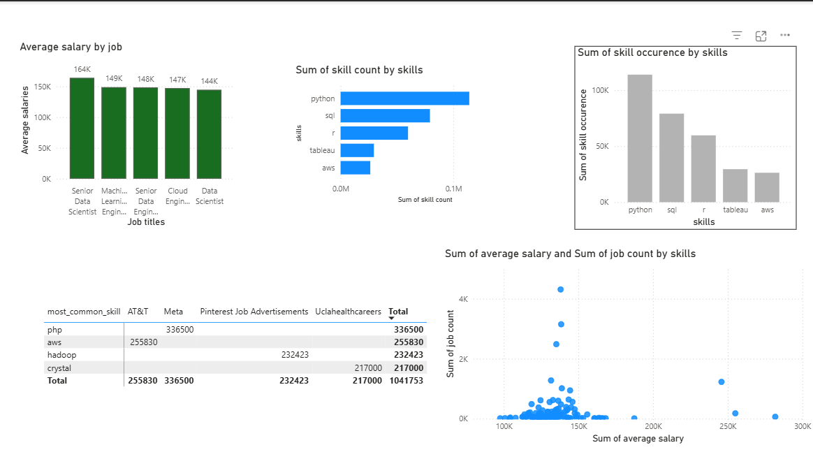

# 📊 SQL for Data Analytics – Final Project

This project was completed while taking [Luke Barousse’s SQL for Data Analysis Course](https://www.youtube.com/watch?v=9Pzj7Aj25lw).  
It applies advanced SQL techniques to explore a job postings dataset and uncover insights about Data Scientist roles.

---

** If you want to check out the Interactive dashboard!**  
👉 [**Explore the full Power BI dashboard here**](https://app.powerbi.com/groups/me/reports/d22849d0-468c-4f38-bf48-8492115509c3?ctid=d59ded02-7bf2-48c9-8627-3d11bde417ab&pbi_source=linkShare)

### What I did

- Cleaned and modeled ~20,000 real 2024 Data Scientist job postings in PostgreSQL
- Wrote advanced SQL queries (CTEs, window functions, joins)
- Built an interactive Power BI dashboard on top of the results

Feel free to check out the SQL files or play with the live version!

## 🎯 Objectives

- Analyze job postings to:
  - Identify the most in-demand skills.
  - Discover which skills command the highest salaries.
  - Pinpoint the highest-paying remote opportunities.

---

## 🗂️ Data Tables

- `job_postings_fact`
- `company_dim`
- `skills_dim`
- `skills_job_dim`

---

## 🧩 Final Queries

Below are the main queries developed as part of the project:

1️⃣ [Skills That Bring In The Most Money](project_sql/top_skills_based_on_salary.sql)

2️⃣ [Top 10 Highest-Paying Remote Data Scientist Jobs with Skills](project_sql/top_paying_skills.sql)

3️⃣ [Top 10 Highest-Paying Remote Data Scientist Jobs](project_sql/top_paying_jobs.sql)

4️⃣ [Average Salary and Frequency per Skill](project_sql/optimal_skills_to_learn.sql)

5️⃣ [Top 5 Most Demanded Skills](project_sql/in_demand_skills.sql)

---

## ✅ Outcomes

Completing this project has:

- Reinforced practical SQL skills.
- Built confidence with CTEs, subqueries, joins, and aggregations.
- Produced insights relevant to real-world hiring data.

---

## 🙌 Acknowledgments

[Luke Barousse – SQL for Data Analysis](https://www.youtube.com/watch?v=7mz73uXD9DA)

---

**Note:** All queries are saved in the `project_sql\` folder for easy access.
